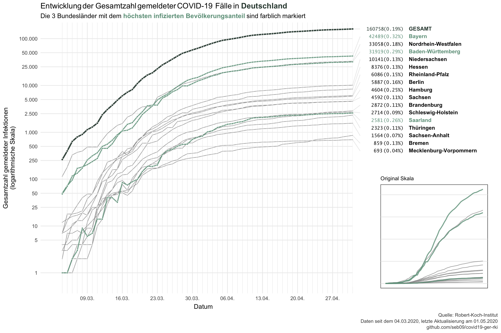

Data from the Robert-Koch-Institut on COVID-19 in Germany
================
Last update: 2020-04-11

This repository contains data on reported COVID-19 cases in Germany and
its federal states that is published daily by the Robert-Koch-Institut
(RKI).

``` r
library(tidyverse)
corona_rki <- read_csv("data/corona_deu_rki.csv")
corona_rki %>% 
  arrange(desc(Datum), Bundesland) %>% 
  print(n = 16)
```

    ## # A tibble: 618 x 6
    ##    Datum      Bundesland      Fallzahl Todeszahl Fallzahl_neu Todeszahl_neu
    ##    <date>     <chr>              <dbl>     <dbl>        <dbl>         <dbl>
    ##  1 2020-04-11 Baden-Württemb…    23617       622         1184            52
    ##  2 2020-04-11 Bayern             31453       747         1090            44
    ##  3 2020-04-11 Berlin              4458        46          109             4
    ##  4 2020-04-11 Brandenburg         1764        37           73             0
    ##  5 2020-04-11 Bremen               469        15           15             2
    ##  6 2020-04-11 Hamburg             3663        56          112             3
    ##  7 2020-04-11 Hessen              5808       120          114             9
    ##  8 2020-04-11 Mecklenburg-Vo…      601        11           15             0
    ##  9 2020-04-11 Niedersachsen       7343       171          229            10
    ## 10 2020-04-11 Nordrhein-West…    23644       472          616            26
    ## 11 2020-04-11 Rheinland-Pfalz     4622        59          182             8
    ## 12 2020-04-11 Saarland            2016        41          162             5
    ## 13 2020-04-11 Sachsen             3565        65          163             6
    ## 14 2020-04-11 Sachsen-Anhalt      1135        18           14             0
    ## 15 2020-04-11 Schleswig-Hols…     2065        39           36             1
    ## 16 2020-04-11 Thüringen           1435        25           19             1
    ## # … with 602 more rows

Data is downloaded each day at 11am from the [website of the
RKI](https://www.rki.de/DE/Content/InfAZ/N/Neuartiges_Coronavirus/Fallzahlen.html)
(and updated again at 11pm). The time stamp refers to the day when the
data was downloaded.

Population sizes of the federal states were scraped from
[Wikipedia](https://de.wikipedia.org/wiki/Liste_der_deutschen_Bundesl%C3%A4nder_nach_Bev%C3%B6lkerung)
and are also available in this repo.

``` r
population <- read_csv("data/einwohner_bundesland.csv")
population
```

    ## # A tibble: 16 x 2
    ##    Bundesland             Einwohner
    ##    <chr>                      <dbl>
    ##  1 Baden-Württemberg       11069533
    ##  2 Bayern                  13076721
    ##  3 Berlin                   3644826
    ##  4 Brandenburg              2511917
    ##  5 Bremen                    682986
    ##  6 Hamburg                  1841179
    ##  7 Hessen                   6265809
    ##  8 Mecklenburg-Vorpommern   1609675
    ##  9 Niedersachsen            7982448
    ## 10 Nordrhein-Westfalen     17932651
    ## 11 Rheinland-Pfalz          4084844
    ## 12 Saarland                  990509
    ## 13 Sachsen                  4077937
    ## 14 Sachsen-Anhalt           2208321
    ## 15 Schleswig-Holstein       2896712
    ## 16 Thüringen                2143145

I’ll try to update the data daily and produce a plot from time to time.
Most plots will probably be in German. You’re welcome to use them.

-----


