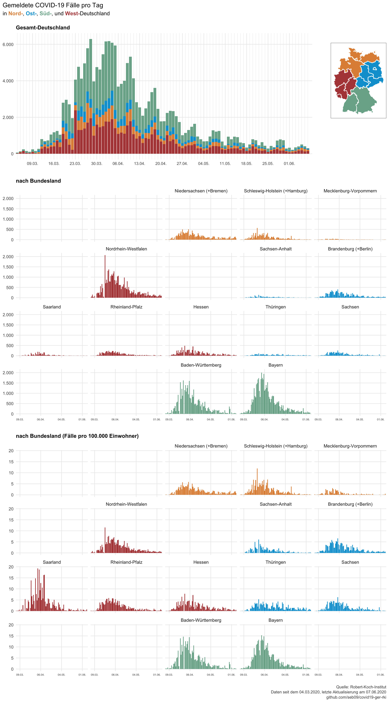

Data from the Robert-Koch-Institut on COVID-19 in Germany
================
Last update: 2020-05-14

This repository contains data on reported COVID-19 cases in Germany and
its federal states that is published daily by the Robert-Koch-Institut
(RKI).

``` r
library(tidyverse)
corona_rki <- read_csv("data/corona_deu_rki.csv")
corona_rki %>% 
  arrange(desc(Datum), Bundesland) %>% 
  print(n = 16)
```

    ## # A tibble: 1,130 x 6
    ##    Datum      Bundesland      Fallzahl Todeszahl Fallzahl_neu Todeszahl_neu
    ##    <date>     <chr>              <dbl>     <dbl>        <dbl>         <dbl>
    ##  1 2020-05-13 Baden-Württemb…    33518      1594          159            26
    ##  2 2020-05-13 Bayern             44802      2209          209            27
    ##  3 2020-05-13 Berlin              6298       170           24             5
    ##  4 2020-05-13 Brandenburg         3125       137           14             1
    ##  5 2020-05-13 Bremen              1077        36           19             1
    ##  6 2020-05-13 Hamburg             4972       223           12             7
    ##  7 2020-05-13 Hessen              9087       419           56             4
    ##  8 2020-05-13 Mecklenburg-Vo…      736        20            7             0
    ##  9 2020-05-13 Niedersachsen      10903       508            8             1
    ## 10 2020-05-13 Nordrhein-West…    35555      1473          222            17
    ## 11 2020-05-13 Rheinland-Pfalz     6360       207            5             1
    ## 12 2020-05-13 Saarland            2667       144            2             0
    ## 13 2020-05-13 Sachsen             4962       191           15             1
    ## 14 2020-05-13 Sachsen-Anhalt      1650        52            2             2
    ## 15 2020-05-13 Schleswig-Hols…     2972       125           16             0
    ## 16 2020-05-13 Thüringen           2622       126           28             8
    ## # … with 1,114 more rows

Data is downloaded each day at 11am from the [website of the
RKI](https://www.rki.de/DE/Content/InfAZ/N/Neuartiges_Coronavirus/Fallzahlen.html)
(and updated again at 11pm). The time stamp refers to the day when the
data was downloaded.

Population sizes of the federal states were scraped from
[Wikipedia](https://de.wikipedia.org/wiki/Liste_der_deutschen_Bundesl%C3%A4nder_nach_Bev%C3%B6lkerung)
and are also available in this repo.

``` r
population <- read_csv("data/einwohner_bundesland.csv")
population
```

    ## # A tibble: 16 x 2
    ##    Bundesland             Einwohner
    ##    <chr>                      <dbl>
    ##  1 Baden-Württemberg       11069533
    ##  2 Bayern                  13076721
    ##  3 Berlin                   3644826
    ##  4 Brandenburg              2511917
    ##  5 Bremen                    682986
    ##  6 Hamburg                  1841179
    ##  7 Hessen                   6265809
    ##  8 Mecklenburg-Vorpommern   1609675
    ##  9 Niedersachsen            7982448
    ## 10 Nordrhein-Westfalen     17932651
    ## 11 Rheinland-Pfalz          4084844
    ## 12 Saarland                  990509
    ## 13 Sachsen                  4077937
    ## 14 Sachsen-Anhalt           2208321
    ## 15 Schleswig-Holstein       2896712
    ## 16 Thüringen                2143145

I’ll try to update the data daily. You can import the most recent
version directly from GitHub.

``` r
library(readr)
corona_rki <- read_csv("https://raw.githubusercontent.com/seb09/covid19-ger-rki/master/data/corona_deu_rki.csv")
```

I will also produce a plot from time to time, probably in German. You’re
welcome to use them.

-----


[Full
size](https://github.com/seb09/covid19-ger-rki/raw/master/plots/covid19-deu-rki-entwicklung-original-skala.png)

-----


[Full
size](https://github.com/seb09/covid19-ger-rki/raw/master/plots/covid19-deu-rki-entwicklung.png)

-----



[Full
size](https://github.com/seb09/covid19-ger-rki/raw/master/plots/covid19-deu-rki-faelle-pro-tag.png)
