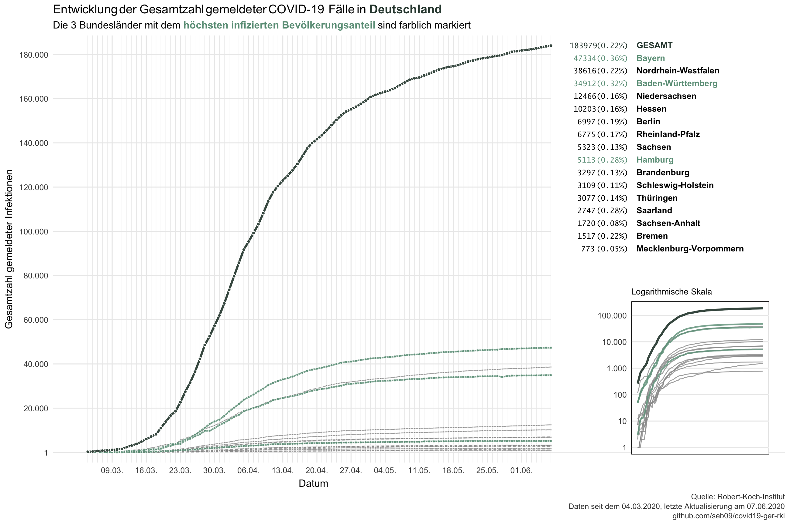

Data from the Robert-Koch-Institut on COVID-19 in Germany
================
Last update: 2020-05-14

This repository contains data on reported COVID-19 cases in Germany and
its federal states that is published daily by the Robert-Koch-Institut
(RKI).

``` r
library(tidyverse)
corona_rki <- read_csv("data/corona_deu_rki.csv")
corona_rki %>% 
  arrange(desc(Datum), Bundesland) %>% 
  print(n = 16)
```

    ## # A tibble: 1,146 x 6
    ##    Datum      Bundesland      Fallzahl Todeszahl Fallzahl_neu Todeszahl_neu
    ##    <date>     <chr>              <dbl>     <dbl>        <dbl>         <dbl>
    ##  1 2020-05-14 Baden-Württemb…    33670      1608          152            14
    ##  2 2020-05-14 Bayern             44980      2229          178            20
    ##  3 2020-05-14 Berlin              6342       173           44             3
    ##  4 2020-05-14 Brandenburg         3135       138           10             1
    ##  5 2020-05-14 Bremen              1104        37           27             1
    ##  6 2020-05-14 Hamburg             4976       228            4             5
    ##  7 2020-05-14 Hessen              9169       423           82             4
    ##  8 2020-05-14 Mecklenburg-Vo…      739        20            3             0
    ##  9 2020-05-14 Niedersachsen      11003       524          100            16
    ## 10 2020-05-14 Nordrhein-West…    35741      1483          186            10
    ## 11 2020-05-14 Rheinland-Pfalz     6382       212           22             5
    ## 12 2020-05-14 Saarland            2677       145           10             1
    ## 13 2020-05-14 Sachsen             5031       195           69             4
    ## 14 2020-05-14 Sachsen-Anhalt      1656        52            6             0
    ## 15 2020-05-14 Schleswig-Hols…     2982       125           10             0
    ## 16 2020-05-14 Thüringen           2652       131           30             5
    ## # … with 1,130 more rows

Data is downloaded each day at 11am from the [website of the
RKI](https://www.rki.de/DE/Content/InfAZ/N/Neuartiges_Coronavirus/Fallzahlen.html)
(and updated again at 11pm). The time stamp refers to the day when the
data was downloaded.

Population sizes of the federal states were scraped from
[Wikipedia](https://de.wikipedia.org/wiki/Liste_der_deutschen_Bundesl%C3%A4nder_nach_Bev%C3%B6lkerung)
and are also available in this repo.

``` r
population <- read_csv("data/einwohner_bundesland.csv")
population
```

    ## # A tibble: 16 x 2
    ##    Bundesland             Einwohner
    ##    <chr>                      <dbl>
    ##  1 Baden-Württemberg       11069533
    ##  2 Bayern                  13076721
    ##  3 Berlin                   3644826
    ##  4 Brandenburg              2511917
    ##  5 Bremen                    682986
    ##  6 Hamburg                  1841179
    ##  7 Hessen                   6265809
    ##  8 Mecklenburg-Vorpommern   1609675
    ##  9 Niedersachsen            7982448
    ## 10 Nordrhein-Westfalen     17932651
    ## 11 Rheinland-Pfalz          4084844
    ## 12 Saarland                  990509
    ## 13 Sachsen                  4077937
    ## 14 Sachsen-Anhalt           2208321
    ## 15 Schleswig-Holstein       2896712
    ## 16 Thüringen                2143145

I’ll try to update the data daily. You can import the most recent
version directly from GitHub.

``` r
library(readr)
corona_rki <- read_csv("https://raw.githubusercontent.com/seb09/covid19-ger-rki/master/data/corona_deu_rki.csv")
```

I will also produce a plot from time to time, probably in German. You’re
welcome to use them.

-----



[Full
size](https://github.com/seb09/covid19-ger-rki/raw/master/plots/covid19-deu-rki-entwicklung-original-skala.png)

-----


[Full
size](https://github.com/seb09/covid19-ger-rki/raw/master/plots/covid19-deu-rki-entwicklung.png)

-----


[Full
size](https://github.com/seb09/covid19-ger-rki/raw/master/plots/covid19-deu-rki-faelle-pro-tag.png)
